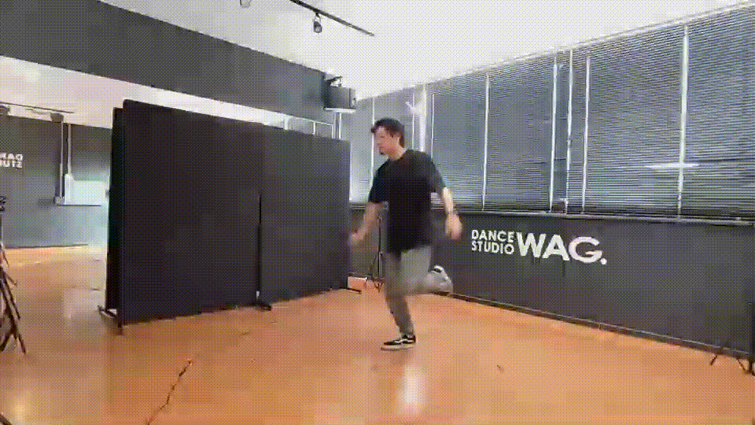
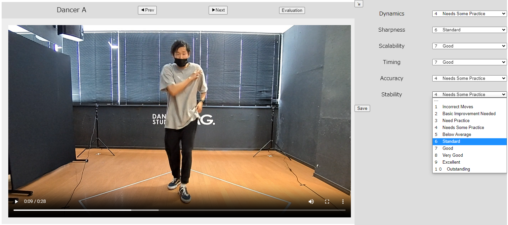

# Automatic Evaluation of Dance Performance
  Welcome to our project! Here, we develop AI models for evaluating dance performance using our unique dataset, Dance Database for Performance Analysis (DDPA). Explore our dataset, model training demos, and the dance evaluation annotation tool.  
    
## Dataset  
  This dance dataset was collected with the cooperation of 18 students ranging from elementary school students to college students who attend a dance studio. The dataset includes video data, 3D motion data inferred from the videos, and evaluation data for the dance.  

### Videos
  Dance performances were captured using 4 cameras, providing multiple angles and perspectives.  
  The original dance performance videos are available at [here](https://drive.google.com/uc?id=1gpFwfQfyTHlhG6PmXiqpz215XJ4dK7TY).
  
    
  Please note that all audio has been removed due to copyright issues.  
  The music used in these dance sequences can be listened to [here](https://www.youtube.com/watch?v=AjsjfBtFTJI), starting from the 17-second mark.  
  
### 3D Motion Data
  The motion data is derived from the video data, specifically presenting a timeseries of 3D coordinates for each joint. The 2D keypoints were detected using the [MediaPipe](https://github.com/google/mediapipe) pose model, and then transformed into 3D coordinates using the Singular Value Decomposition (SVD) method. The motion data is available at [here](https://drive.google.com/uc?id=1DYGHbrxAEtDcVPCeM_oZyXNpEGZD4S8G).  
  
### Annotations
  The annotation data is compiled into CSV format, providing evaluation data for each dance performance. Each row includes:
  ```
  ID : A unique identifier for each dance data
  Dancer : A unique identifier for each dancer
  Date : The date when the data was created
  DataPath : The file path to the corresponding motion data
  Grade : A code representing the grade level (0: Teacher, 1: Elementary school, 2: Middle school, 3: High school, 4: University)
  IsReference : A flag indicating if the data serves as a reference
  Annotated : A flag indicating whether the dance has been annotated with evaluation data
  ```
  The evaluation metrics used for the annotations include:

  - ***Dynamics*** ... The weight and energy of the movements
  - ***Sharpness*** ... The speed variations and sharpness of movements  
  - ***Scalability*** ... The size of the movements and use of space  
  - ***Timing*** ... The timing, rhythm, and harmony with the music  
  - ***Accuracy*** ... The precision and meticulousness of the movements and body placement  
  - ***Stability*** ... The balance and body control of the dancer
  
  All these evaluations are annotated by exparts on a scale of 1 to 10.  
  The evaluation data is available at [here](https://drive.google.com/uc?id=1HhCZ1SrpI4E-5IE2cGAoJcP8LcyuVlyJ).  

## Model Training  
  Training Demo is available at Google Colaboratory  
  [](https://colab.research.google.com/github/kazuhiro1999/Automatic-Evaluation-of-Dance-Movements/blob/main/train.ipynb)  


## Annotation Tool  
  We have created a dance evaluation tool for the purpose of annotating evaluations on the dance performances. This tool aids in providing structured feedback based on specific aspects of each dance performance.  
  A sample of the annotation tool is available for use and can be accessed at [here](https://kazuhiro1999.github.io/Automatic-Evaluation-of-Dance-Movements/).  
    
  

## Citation  
```bibtex
@article{Esaki2024Efficient,
    author = {Esaki, Kazuhiro and Nagao, Katashi},
    title = {An Efficient Immersive Self-Training System for Hip-Hop Dance Performance with Automatic Evaluation Features},
    journal = {Applied Sciences},
    volume = {14},
    number = {14},
    pages = {5981},
    year = {2024},
    doi = {10.3390/app14145981},
    publisher = {MDPI},
    issn = {2076-3417}
}
```
